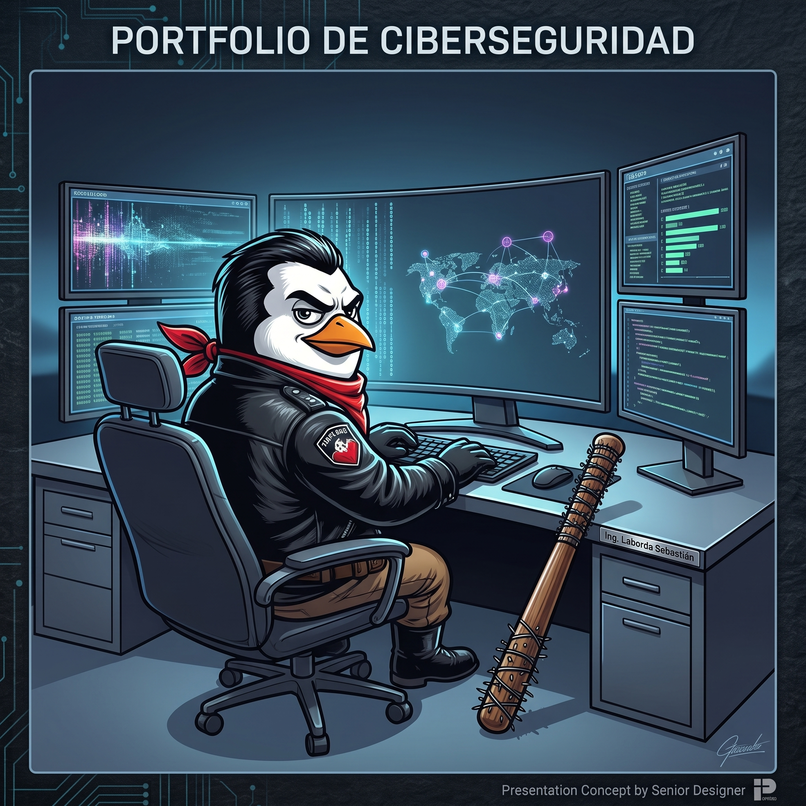

# Portafolio de Ciberseguridad - Sebastián Laborda

  

## Sobre Mí
¡Hola! Soy Sebastián Laborda. Este repositorio sirve como mi portafolio práctico de ciberseguridad, donde documento y comparto los ejercicios y proyectos desarrollados a lo largo del **Certificado Profesional de Ciberseguridad de Google** (actualmente en curso: 4/9 cursos completados).

> **Nota Importante:** Todo el material y los reportes documentados en este repositorio están redactados de manera bilingüe, disponibles tanto en **Inglés** como en **Español** en el interior de cada archivo.

## Habilidades Técnicas Demostradas
- **Auditoría y Gestión de Riesgos:** Evaluaciones de seguridad, planes de acción y cumplimiento de normativas.
- **Respuesta a Incidentes y Framework NIST:** Análisis de incidentes reales utilizando estándares de la industria.
- **Herramientas de Línea de Comandos y Bases de Datos:** Dominio de Linux (gestión de permisos de archivos) y SQL (filtros de consultas).
- **Análisis de Redes:** Captura y evaluación de tráfico de red para la detección de anomalías.

## Índice de Proyectos

### 📂 01. Auditorías y Evaluación de Riesgos
| Proyecto | Descripción |
|----------|-------------|
| [Auditoría de Seguridad: Controles y Cumplimiento](./01_Auditorias_y_Evaluacion_de_Riesgos/Auditoria_de_Seguridad_Controles_y_Cumplimiento.pdf) | Informe completo sobre auditoría interna de controles. |
| [Plan de Acción y Comunicación Directiva](./01_Auditorias_y_Evaluacion_de_Riesgos/Plan_de_Accion_y_Comunicacion_Directiva.pdf) | Estrategia de comunicación de hallazgos de ciberseguridad a la dirección. |
| [Reporte de Evaluación de Riesgos](./01_Auditorias_y_Evaluacion_de_Riesgos/Reporte_Evaluacion_de_Riesgos_de_Seguridad.pdf) | Identificación, análisis y mitigación de amenazas clave. |
| [Registro de Riesgos](./01_Auditorias_y_Evaluacion_de_Riesgos/Registro_de_Riesgos.pdf) | Identificación y evaluación de riesgos de seguridad utilizando una matriz de probabilidad y severidad. |
| [Actividad de Clasificación de Recursos](./01_Auditorias_y_Evaluacion_de_Riesgos/Actividad_de_Clasificacion_de_Recursos/) | Clasificación de activos según acceso, sensibilidad y restricciones. |
| [Análisis de Controles de Acceso](./01_Auditorias_y_Evaluacion_de_Riesgos/Auditoria_Controles_de_Acceso/Analisis_Controles_de_Acceso.pdf)   *(Ver log adjunto: [Base de Datos y Logs](./01_Auditorias_y_Evaluacion_de_Riesgos/Auditoria_Controles_de_Acceso/Base_de_Datos_y_Logs_de_Acceso.xlsx))* | Evaluación de privilegios y autorización de usuarios en el sistema, aplicando principios de mínimo privilegio. |
| [Evaluación de Vulnerabilidades](./01_Auditorias_y_Evaluacion_de_Riesgos/Evaluacion_de_Vulnerabilidades_NIST/Informe_Evaluacion_Vulnerabilidades.pdf)   *(Ver guía adjunta: [NIST SP 800-30 Rev. 1](./01_Auditorias_y_Evaluacion_de_Riesgos/Evaluacion_de_Vulnerabilidades_NIST/Guia_NIST_SP_800_30_Rev1.pdf))* | Informe de evaluación de vulnerabilidades de un servidor de base de datos aplicando la guía de riesgos NIST SP 800-30. |

### 📂 02. Respuesta a Incidentes y Framework NIST
| Proyecto | Descripción |
|----------|-------------|
| [Análisis de Incidente: Framework NIST](./02_Respuesta_a_Incidentes_y_NIST/Analisis_Incidente_Framework_NIST.pdf) | Aplicación rigurosa del marco NIST a un incidente documentado. |
| [Análisis de Filtración de Datos (Mínimo Privilegio)](./02_Respuesta_a_Incidentes_y_NIST/Analisis_Filtracion_de_Datos.pdf) | Análisis de un incidente de fuga de datos basado en el control AC-6 de NIST (Mínimo Privilegio). |
| [Reporte General de Incidente](./02_Respuesta_a_Incidentes_y_NIST/Reporte_General_Incidente_de_Seguridad.pdf) | Documentación estándar de procedimientos de manejo de incidentes. |
| [Reporte de Incidente y Evidencia HTTP](./02_Respuesta_a_Incidentes_y_NIST/Reporte_Incidente_y_Evidencia_HTTP.pdf)   *(Ver log adjunto: [Log HTTP](./02_Respuesta_a_Incidentes_y_NIST/Log_HTTP_Evidencia.xlsx))* | Análisis detallado de una brecha utilizando registros de tráfico web. |

### 📂 03. Linux y SQL
| Proyecto | Descripción |
|----------|-------------|
| [Gestión de Permisos en Linux](./03_Linux_y_SQL/Gestion_de_Permisos_en_Linux.pdf) | Aplicación de permisos, propietarios y grupos en entorno Bash. |
| [Aplicación de Filtros SQL](./03_Linux_y_SQL/Aplicacion_de_Filtros_en_Consultas_SQL.pdf) | Ejecución de consultas robustas para extracción de datos de seguridad. |

### 📂 04. Análisis de Tráfico y Redes
| Proyecto | Descripción |
|----------|-------------|
| [Análisis de Tráfico de Red](./04_Analisis_de_Trafico_y_Redes/Analisis_de_Trafico_de_Red.pdf) | Investigación de paquetes y flujos sospechosos mediante herramientas de red. |

### 📂 05. Perfil Profesional
| Proyecto | Descripción |
|----------|-------------|
| [Declaración Profesional](./05_Perfil_Profesional/Declaracion_Profesional.pdf) | Resumen de mis objetivos profesionales, ética y proyección en el campo. |

## Próximos Pasos
A medida que avance en los cursos restantes del programa (Detección de Amenazas, Automatización con Python y Preparación Laboral), estaré sumando nuevos laboratorios enfocados en el uso de SIEMs (Splunk, Chronicle), scripting automatizado, y análisis avanzado de vulnerabilidades.

---

**Contacto:** 
- Puedes encontrar más detalles sobre mi experiencia y conectar conmigo en [LinkedIn](https://linkedin.com/).
